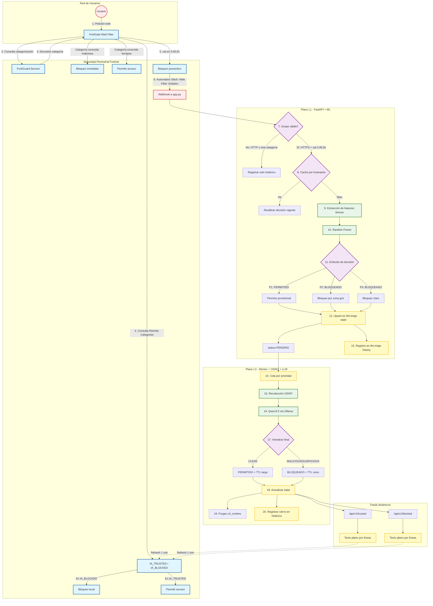

# Trabajo Fin de Máster

## Detección y curación de URLs dudosas en entornos FortiGate mediante una arquitectura híbrida ML+LLM local

Autor: Sergio Alonso Berrido

Tutor: Fernando Wanguemert

Fecha: 16/03/2026

Máster en IA Aplicada a la Ciberseguridad

Universidad Católica de Murcia, UCAM

## Resumen ejecutivo

Este Trabajo Fin de Máster diseña e implementa un sistema para tratar automáticamente eventos web dudosos en FortiGate, concretamente aquellos clasificados como **Unrated**, **Newly Observed Domain** y **Newly Registered Domain**. La solución adopta una premisa deliberadamente conservadora: el firewall **bloquea primero** y el sistema **analiza después**, de modo que la primera petición no depende de un motor analítico inline.

La arquitectura combina dos planos complementarios. El primero es un plano **L1** de triaje rápido basado en **Random Forest**, que reutiliza decisiones previas, extrae características léxicas de la URL y genera un veredicto preliminar. El segundo es un plano **L3** asíncrono basado en un **LLM local** vía Ollama, que enriquece con fuentes OSINT, corrige o confirma la decisión inicial y mantiene memoria operativa en OpenSearch. Se adopta la nomenclatura L1/L3 para diferenciar un plano inicial de triaje rápido y un plano profundo de consolidación cognitiva; no se define un L2 porque en esta versión no existe una capa intermedia autónoma entre ambos.

El conocimiento resultante se devuelve al perímetro mediante dos feeds dinámicos consumidos por FortiGate (`IA_TRUSTED` e `IA_BLOCKED`). Así, el valor del sistema no reside en dejar pasar la primera petición, sino en **curar la memoria perimetral** para accesos posteriores, reduciendo fricción operativa y mejorando la postura de seguridad sin externalizar telemetría sensible a servicios de terceros.

El funcionamiento práctico se detalla en el **Anexo 1** y el flujo arquitectónico en el **Anexo 2**.

---

## 1\. Introducción

La protección web empresarial depende en gran medida de motores de reputación y categorización externos. Esto funciona razonablemente bien para dominios conocidos, pero genera un problema recurrente con dominios nuevos, efímeros o aún no clasificados. En FortiGate, una política prudente de bloqueo en categorías dudosas mejora la seguridad, aunque introduce fricción cuando el dominio bloqueado es legítimo y tarda en ser clasificado.

El problema práctico es doble. Por un lado, un dominio malicioso puede estar operativo antes de que el fabricante o las listas públicas converjan. Por otro, derivar cada URL dudosa a análisis manual no escala en un entorno SOC real. El presente TFM se sitúa precisamente en ese espacio intermedio: automatizar el tratamiento de eventos dudosos sin perder trazabilidad, explicabilidad ni soberanía del dato.

Desde el punto de vista del estado del arte, existen tres enfoques dominantes: listas estáticas y reputación, motores cloud o sandboxing avanzado y plataformas SIEM/SOAR con distintos niveles de automatización. La propuesta desarrollada aquí no pretende competir con un sandbox comercial completo, sino ofrecer una capacidad intermedia y realista: **curar localmente la memoria del perímetro** mediante un plano rápido de ML y un plano profundo de consolidación cognitiva.

Este TFM toma como punto de partida una propuesta centrada en la detección de dominios y URLs falsas mediante señales léxicas simples y métricas fáciles de interpretar. A partir de esa base, el trabajo amplía el alcance hacia una arquitectura híbrida ML+LLM local orientada al triaje y la curación operativa de URLs dudosas en entornos FortiGate.

**Objetivo general.** Diseñar y validar una arquitectura híbrida ML+LLM local para el triaje y la curación de URLs dudosas en entornos FortiGate.  
**Pregunta de investigación.** Determinar si una arquitectura híbrida ML+LLM local puede mejorar la gestión de URLs dudosas en entornos FortiGate, reduciendo fricción operativa y reforzando la soberanía del dato sin comprometer la viabilidad práctica del despliegue.  
**Hipótesis de trabajo.** Se plantea que la combinación de un plano L1 de triaje rápido y un plano L3 cognitivo local permite mejorar la gestión de URLs dudosas al combinar rapidez de decisión inicial, revisión contextual y aplicación operativa en el perímetro, manteniendo un mayor control sobre el tratamiento local de la información. La rapidez del plano L1 se refiere al tiempo de inferencia, no al tiempo de aplicación efectiva en el firewall, que depende del refresco del _feed_.  
**Criterio de validación.** La propuesta se considera satisfactoria si demuestra coherencia arquitectónica, utilidad práctica en escenarios representativos y un comportamiento del L1 compatible con su función de triaje dentro de la arquitectura completa.

---

## 2\. Aportaciones

Las aportaciones principales del trabajo son:

1.  **Arquitectura híbrida dual-speed** para tratamiento de URLs dudosas en FortiGate, combinando un plano L1 estadístico de triaje rápido y un plano L3 cognitivo asíncrono.
2.  **Integración real con FortiGate** mediante categorías remotas (`IA_TRUSTED`, `IA_BLOCKED`) consumidas por polling, sin insertar lógica de decisión inline en la primera petición.
3.  **Persistencia dual en OpenSearch**, separando estado operativo vigente e histórico saneado, con TTL y trazabilidad.
4.  **Privacidad desde el diseño**, mediante uso de LLM local y purga de la URL cruda tras el cierre del ticket.
5.  **Pipeline reproducible** de dataset, entrenamiento, despliegue y operación con componentes open source.

### 2.1 Valor diferencial del trabajo

La originalidad del TFM no reside en proponer un algoritmo nuevo, sino en **integrar de forma coherente** distintas capas de tecnología para un caso de uso perimetral concreto. El paso de una lógica estática de bloqueo a una lógica de **memoria curada**, apoyada en ML, LLM local y persistencia operativa, constituye la principal aportación arquitectónica y operativa del proyecto.

---

## 3\. Definición de la solución

### 3.1 Alcance operativo

La implementación final se activa solo para eventos dentro de un alcance acotado:

- `service = HTTPS`
- `cat = 0` (**Unrated**)
- `cat = 90` (**Newly Observed Domain**)
- `cat = 91` (**Newly Registered Domain**)

Este recorte de alcance no es una limitación accidental, sino una decisión de diseño para construir un caso de uso **end-to-end, medible y defendible**. Las categorías fuera de este ámbito siguen siendo gobernadas por la política ordinaria de FortiGate.

### 3.2 Integración con FortiGate

FortiGate bloquea primero la petición conforme a la política Web Filter. El sistema no intercepta el tráfico inline. En su lugar, un **Automation Stitch** dispara un webhook hacia `app` cuando se produce una violación de Web Filter en el ámbito definido, enviando un JSON con los campos `service`, `cat`, `action`, `hostname`, `url`, `eventtime` y `catdesc`. El sistema analiza el evento y actualiza dos feeds dinámicos:

- `/api/v1/trusted`
- `/api/v1/blocked`

FortiGate consume esos feeds como **Remote Categories** con `refresh-rate=1`, por lo que la mejora se aplica en accesos posteriores. En la implantación real, esta integración se apoya en FortiOS 7.4.9, modo `flow-based` y perfiles de Web Filter sobre servicios `HTTP/HTTPS`. Aunque el perfil de Web Filter de FortiGate opera sobre ambos servicios, en esta versión la lógica de tratamiento del sistema solo entra en acción para eventos `service = HTTPS`, de acuerdo con el alcance definido. Los eventos HTTP quedan fuera de alcance y, en su caso, se descartan o se registran únicamente a efectos de histórico.

### 3.3 Arquitectura lógica

La arquitectura se compone de dos planos:

- **L1 (rápido)** `app`**:** FastAPI + caché por hostname + Random Forest.
- **L3 (profundo)** `worker`**:** worker asíncrono + OSINT + LLM local.

Y de dos índices OpenSearch:

- `tfm-triaje-state`: decisión vigente por hostname, TTL y base de los feeds.
- `tfm-triaje-history`: histórico saneado de eventos y decisiones.

Esta separación evita mezclar el estado vivo que consume el firewall con eventos históricos, correcciones y datos ya expirados.

### 3.4 Justificación de diseño

Las decisiones arquitectónicas más importantes son:

- Enforcement por FQDN (`hostname` + `*.hostname`) en lugar de URL completa, por robustez operativa, menor coste de _matching_ y mejor compatibilidad con el perímetro. Aunque esta decisión implica una menor granularidad que el análisis por URL completa, su impacto sobre dominios ampliamente consolidados es prácticamente inexistente, dado que el flujo solo se activa sobre destinos previamente clasificados como dudosos por la capa de filtrado perimetral.
- **Arquitectura post-decisión**, para no introducir latencia inline ni acoplar el análisis al tráfico productivo.
- **Random Forest** como L1, por su buen encaje con features tabulares/léxicas, su bajo coste de inferencia y su validación eficiente mediante OOB.
- **LLM local**, para preservar soberanía del dato y evitar enviar telemetría web corporativa a APIs de terceros.
- **Separación** `state/history`, para no mezclar decisión viva e histórico y evitar corrupción del estado operativo.

Las decisiones ampliadas y las alternativas descartadas se desarrollan en el **Anexo 3**.

---

## 4\. Desarrollo

### 4.1 Flujo operativo

El flujo real del sistema es el siguiente:

1.  FortiGate bloquea una URL dentro del alcance.
2.  Se envía un webhook al plano L1.
3.  Si el evento está fuera de scope, se registra solo en histórico.
4.  Si entra en scope, se consulta caché por hostname.
5.  Si no hay decisión vigente, se extraen features y se ejecuta el modelo L1.
6.  L1 genera una decisión preliminar y un nivel de prioridad para revisión en L3.
7.  El worker L3 consume la tarea, consulta OSINT y solicita veredicto al LLM local.
8.  La decisión final actualiza `tfm-triaje-state`, se registra en `tfm-triaje-history` y se purga la URL cruda.
9.  FortiGate recoge el nuevo feed en el siguiente refresco.

Conviene precisar que `P1`, `P2` y `P3` expresan **prioridad de revisión en el plano L3**, no severidad del incidente: el worker atiende primero `P1` porque corresponde a casos con **permiso provisional** y **TTL corto**, donde una validación temprana reduce fricción sobre dominios probablemente legítimos, mientras que `P2` y `P3` permanecen en **bloqueo conservador** y toleran una latencia mayor de auditoría.

La memoria operativa por `hostname` actúa como primer criterio de precedencia. Cuando existe una decisión vigente en caché, esta se reutiliza y no se reejecuta el triaje L1. Solo cuando no existe una decisión vigente se extraen _features_ y se ejecuta el clasificador. En esta versión, el reanálisis profundo se reserva para los casos que requieren consolidación o revisión posterior del estado.

En esta iteración se ha optado por un funcionamiento mayoritariamente automatizado, complementado con notificación al equipo de TI mediante webhook cuando el plano L3 autoriza una nueva URL. Aun así, la arquitectura es compatible con la incorporación futura de un esquema _Human in the Loop_ (HITL) en fases concretas de revisión, validación o consolidación de decisiones.

### 4.2 Modelo L1

El plano L1 utiliza un **Random Forest** entrenado sobre un dataset enriquecido y deduplicado. La representación de cada URL se basa en features léxicas, entre ellas:

- longitud de la URL,
- longitud del host,
- número de puntos, guiones, barras y dígitos,
- número de subdominios,
- presencia de IP,
- keywords sospechosas,
- entropía.

La lógica de decisión aplica dos umbrales:

- `T_BLOCK = 0.20`
- `T_ALLOW = 0.92`

La clase positiva del clasificador L1 se corresponde con la categoría **URL maliciosa**. En consecuencia, la salida principal del modelo se interpreta como `p_mal`, esto es, la probabilidad estimada de que la URL analizada pertenezca a la clase maliciosa. A partir de esta magnitud se definen dos umbrales operativos: si `p_mal ≥ T_BLOCK`, se activa una decisión conservadora de bloqueo inicial; si `1 - p_mal ≥ T_ALLOW`, se admite una decisión provisional de permiso; y en la zona intermedia el clasificador no se interpreta como criterio autónomo de decisión final, sino como mecanismo de priorización y escalado hacia el plano L3. Los umbrales no pretenden expresar una frontera teórica universal, sino un punto de operación coherente con el objetivo del sistema: priorizar la prudencia inicial y delegar en el plano L3 la consolidación de los casos no concluyentes.

### 4.3 Modelo L3

El plano L3 no trabaja como un agente libre, sino como un **consolidador de inteligencia OSINT estructurada**. El worker consulta fuentes como RDAP, blocklists DNS, VirusTotal, Google Safe Browsing, URLhaus, ThreatFox, OTX, urlscan y crt.sh. Ese conjunto de señales se empaqueta en un prompt con reglas explícitas y salida JSON estricta.

La implementación final usa un **LLM local** vía Ollama con modelo `Qwen3.5 35B-A3B`, ejecutado con `num_ctx=4096` para controlar el crecimiento del contexto y limitar presión sobre memoria.

Como parte de la auditoría cognitiva, el plano L3 puede proponer un mapeo preliminar sobre MITRE ATT&CK a partir de los indicios observados en la URL, el contexto OSINT y el razonamiento generado por el LLM. En esta memoria, dicho mapeo no se utiliza como criterio autónomo de decisión, sino como salida interpretativa de apoyo para enriquecer la trazabilidad analítica y la contextualización técnico-táctica del caso.

### 4.4 Datos y entrenamiento

El modelo L1 es un **Random Forest** entrenado sobre un dataset compuesto por una base histórica de Kaggle, campañas recientes de **URLhaus** y una fuente local opcional (`local_threats.csv`). Antes del entrenamiento se excluyen IP-literals, se canonizan las URLs para deduplicación y se genera un `dataset_manifest.json` como soporte de trazabilidad. La validación se apoya en un split estratificado 80/20 y en `oob_score=True` como estimación interna complementaria de generalización.

El detalle técnico de construcción del dataset, su trazabilidad y los artefactos asociados se apoya en el repositorio reproducible del proyecto, en particular en `build_dataset.py` y en `dataset_manifest.json`; en el cuerpo principal se mantiene únicamente el resumen necesario para comprender el pipeline.

En la versión actual no se define aún un esquema operativo de reentrenamiento periódico; su incorporación futura se plantea a partir de _feedback_ validado del plano L3 y de métricas operativas observadas en explotación.

### 4.5 Privacidad desde el diseño

El tratamiento del dato se ha diseñado para **minimizar exposición**:

- el LLM es local,
- la URL cruda solo vive temporalmente como `url_runtime`,
- al cierre del ticket se purga,
- y en histórico: `hostname`, `url_path`, `query_keys`, `url_saneada` y `url_sha256`.

Adicionalmente, el plano L3 aplica una política de minimización por integración: las fuentes OSINT basadas en dominio reciben únicamente el `hostname`, mientras que las consultas basadas en URL utilizan una versión minimizada del artefacto, suprimiendo por defecto parámetros de consulta y fragmentos. De este modo, el uso de un LLM local y de una estrategia prudente de minimización reduce de forma significativa la exposición de información sensible a servicios externos y refuerza la soberanía del dato en el procesamiento de los casos analizados. No obstante, esta elección no elimina por completo las exigencias de seguridad y minimización, que siguen dependiendo de medidas complementarias de saneamiento, limitación de persistencia, control de acceso y diseño cuidadoso de las integraciones auxiliares. En consecuencia, la privacidad no debe entenderse aquí como una propiedad absoluta, sino como una mejora sustancial derivada de una arquitectura que prioriza el tratamiento local y la contención del dato.

### 4.6 Despliegue de servicios

El despliegue se realiza mediante un _stack_ contenedorizado en Docker Compose que integra los servicios de entrada, persistencia, procesamiento y publicación de _feeds_, manteniéndose `Ollama` como servicio local externo al _compose_. Esta integración no altera el flujo lógico del sistema, sino únicamente su materialización de despliegue. Desde el punto de vista operativo, la arquitectura debe complementarse con mecanismos de supervisión de procesos, estrategia de reinicio, trazabilidad de errores y gestión de fallos parciales entre webhook, almacenamiento, _worker_ y publicación de _feeds_. Estos aspectos se desarrollan con mayor detalle en el **Anexo 4**. El procedimiento de reinicio limpio del sistema y la limpieza coordinada de FortiGate y OpenSearch se detalla en el **Anexo 5**.

### 4.7 Problemas encontrados y soluciones adoptadas

Durante el desarrollo aparecieron varios problemas relevantes que condicionaron el diseño final:

- **Formato de feeds para FortiGate.** Un error en la serialización de saltos de línea impedía que FortiGate interpretara correctamente el feed. Se corrigió materializando texto plano con una entrada real por línea.
- **Eventos ignorados que contaminaban el estado.** Inicialmente, algunos eventos fuera de scope podían sobrescribir el estado vigente por hostname. La solución fue registrar dichos eventos solo en histórico.
- **Orden de features entre entrenamiento e inferencia.** Se detectó el riesgo de depender implícitamente del orden del diccionario. Se fijó explícitamente una lista de columnas para asegurar coherencia entre `train` e inferencia.
- **Presión de memoria en el plano LLM.** El uso de modelos grandes requería controlar el contexto para evitar degradación del nodo. Se fijó `num_ctx=4096`.
- **Desalineación de variables de entorno.** Se homogeneizaron valores por defecto y `.env` para evitar fallos entre despliegue local y entorno contenedorizado.

Estos problemas son importantes porque muestran que el proyecto no es solo un diseño conceptual, sino una implementación sometida a restricciones reales de ingeniería.

---

## 5\. Evaluación

### 5.1 Evaluación del modelo

La evaluación del plano L1 se articula en torno a métricas adecuadas para clasificación binaria con clases desbalanceadas, en particular **AUPRC**, **matriz de confusión**, **curva Precision–Recall** y **estimación Out-of-Bag (OOB)**. Se emplea un **split estratificado 80/20**, con `random_state = 42`, para preservar la proporción entre clases en entrenamiento y prueba y garantizar la comparabilidad de los resultados.

En la revisión actual, el modelo **Random Forest** del plano L1 se entrenó con **200 estimadores** sobre un conjunto de **632.001 URLs**, compuesto por **427.617 muestras benignas** y **204.384 maliciosas**. Sobre el conjunto de prueba reservado, el entrenamiento reporta una **AUPRC de 0,9633**, mientras que la validación interna **OOB** alcanza un valor de **0,9356**. El detalle numérico de esta evaluación, junto con la matriz de confusión y la curva Precision–Recall, se recoge en el **Anexo 6**.

No obstante, estos resultados no deben interpretarse como un criterio autónomo y suficiente de autorización o bloqueo definitivo. En este trabajo, el plano L1 se concibe como un mecanismo de **triaje temprano**: su función es discriminar con rapidez entre casos de riesgo alto, casos de benignidad alta y casos ambiguos que requieren una auditoría posterior de mayor profundidad. Por ello, las métricas del clasificador deben leerse en relación con su papel operativo dentro del flujo completo, donde la consolidación final de la decisión queda reservada al plano L3 y a la curación perimetral posterior mediante _feeds_ dinámicos.

### 5.2 Evaluación funcional

Además de las métricas del modelo, el sistema se valida funcionalmente mediante escenarios representativos:

- **Amenaza clara en categoría dudosa:** bloqueo inicial y persistencia final en `IA_BLOCKED`.
- **Web legítima no categorizada:** bloqueo inicial y posible curación posterior en `IA_TRUSTED`.
- **Caso ambiguo:** bloqueo inicial y resolución posterior por L3.
- **Evento fuera de scope:** registro solo en histórico, sin alterar el estado vigente.

Dado que la aportación principal del sistema no es solo clasificar URLs, sino curar memoria perimetral, la evaluación operativa relevante debe considerar también indicadores como tiempo hasta curación efectiva, tasa de reutilización de decisiones vigentes, ratio de incorporación a `IA_TRUSTED`/`IA_BLOCKED`, tasa de reversión por L3 y reducción de bloqueos repetidos sobre dominios benignos ya aprendidos. La cuantificación sistemática de estos KPI se plantea como ampliación inmediata del trabajo, sin recargar el cuerpo principal de la memoria.

En una ejecución representativa del prototipo, la recolección OSINT se completó en **42,58 segundos** y la inferencia del LLM en **30,49 segundos**. Estos tiempos, aunque dependientes de la disponibilidad de fuentes externas y del modelo local, resultan compatibles con el objetivo operativo del sistema, ya que el análisis L3 suele completarse dentro de la ventana temporal de propagación del _feed_ perimetral.

Las evidencias visuales de funcionamiento e integración del prototipo se recogen en el **Anexo 7**.

### 5.3 Comparación con baseline

La comparación práctica más relevante es frente al baseline operativo:

| Escenario | FortiGate solo | FortiGate + sistema propuesto |
| --- | --- | --- |
| Dominio `Unrated` legítimo | Bloqueo repetido indefinido | Bloqueo inicial + posible curación posterior |
| Dominio dudoso malicioso | Bloqueo inicial | Bloqueo inicial + consolidación y memoria local |
| Trazabilidad de la decisión | Limitada al log perimetral | Estado, histórico y auditoría cognitiva |
| Dependencia de reputación externa | Alta | Reducida por memoria local y L3 |

La mejora principal observada no es permitir la primera web, sino **reducir repetición de bloqueos sobre benignos ya aprendidos**, disminuir dependencia exclusiva de la reputación externa y mantener explicabilidad sobre la decisión.

---

## 6\. Limitaciones, riesgos y trabajo futuro

La principal limitación del sistema es su **naturaleza asíncrona**: la primera petición siempre se bloquea y la curación no es instantánea, ya que depende del análisis posterior y del refresco del _feed_ por FortiGate. Esta decisión es deliberada y evita introducir latencia _inline_, aunque implica una ventana temporal entre el bloqueo inicial y la aplicación efectiva de la curación.

En el caso de uso planteado, esta fricción operativa se considera aceptable porque el sistema no persigue permitir la primera petición, sino reducir bloqueos repetidos sobre destinos ya revisados sin introducir latencia _inline_. El coste temporal asociado al análisis posterior y al refresco del _feed_ se asume como un compromiso razonable entre prudencia perimetral, simplicidad operativa y bajo acoplamiento con el tráfico productivo. Además, dado que el análisis del plano L3 suele completarse dentro de esa misma ventana temporal, en muchos casos la decisión que termina propagándose al perímetro es ya la consolidada.

Otras limitaciones relevantes son:

- dependencia de la calidad y disponibilidad de fuentes OSINT,
- no cobertura de HTTP ni de categorías fuera del alcance definido,
- límites del _enforcement_ por `hostname` en entornos de _hosting_ compartido,
- necesidad de mantener sano el flujo FortiGate → webhook → OpenSearch → _feed_,
- posibilidad de error del LLM, mitigada mediante _prompting_ restrictivo, TTL y trazabilidad.

Como líneas de trabajo futuro, destacan tres horizontes:

- **Corto plazo:** endurecer el webhook con HMAC/mTLS, _allowlist_ y _rate limiting_; formalizar contratos de datos.
- **Medio plazo:** incorporar _feedback_ validado del plano L3 al reentrenamiento del modelo L1 y mejorar métricas operativas.
- **Largo plazo:** estudiar mecanismos _push_ hacia FortiGate y explorar un _enforcement_ más granular en casos de dominios compartidos.

---

## 7\. Conclusión

El trabajo demuestra la **viabilidad técnica y operativa** de una **arquitectura híbrida** para la **curación de memoria perimetral** frente a **URLs dudosas** en entornos **FortiGate**, combinando un **plano L1 de triaje rápido**, un **plano L3 cognitivo local** y una **persistencia** orientada a **operación** y **trazabilidad**.

Los resultados respaldan la utilidad del enfoque para **automatizar de forma prudente** el tratamiento inicial, la **revisión contextual diferida** y la **consolidación de decisiones** aplicables al **perímetro**. Al mismo tiempo, el desarrollo realizado muestra que el principal reto no reside solo en el modelo, sino en la **integración fiable** entre **firewall**, **webhook**, **almacenamiento**, **LLM** y **publicación de feeds**.

La solución no elimina la **naturaleza asíncrona** del problema: la primera petición sigue bloqueándose y la mejora depende del análisis posterior y del refresco del **feed**. No obstante, esta limitación se asume deliberadamente para mantener una **política conservadora** sin introducir **latencia inline**. Del mismo modo, el uso de un **LLM local**, junto con una **persistencia saneada** y una **política de minimización por integración**, reduce de forma significativa la **externalización de telemetría sensible**, aunque no elimina por completo la necesidad de **controles adicionales**.

En conjunto, la propuesta debe interpretarse como una **arquitectura funcional y ampliable**, no como una solución cerrada. Su principal aportación no es un algoritmo nuevo, sino una integración coherente de **ciberseguridad perimetral**, **aprendizaje automático**, **LLMs locales**, **CTI** y **privacidad desde el diseño**.

La justificación académica del proyecto y su alineación transversal con los módulos del máster se desarrollan en el **Anexo 8**.

## Bibliografía

### Documentación técnica

- Fortinet. Documentación oficial de FortiOS / FortiGate sobre `config system external-resource`, categorías web remotas y operación de _Remote Categories_.
- OpenSearch Project. Documentación oficial de OpenSearch sobre gestión de índices, API REST, `_delete_by_query`, búsquedas y operaciones de mantenimiento.
- Ollama. Documentación oficial de Ollama sobre parámetros de inferencia, control de contexto, temperatura y ejecución local de modelos.
- Scikit-learn Developers. Documentación oficial de scikit-learn sobre `RandomForestClassifier`, `oob_score`, `average_precision_score`, `precision_recall_curve` y `confusion_matrix`.

### Fuentes OSINT y marcos utilizados

- [abuse.ch](http://abuse.ch). URLhaus y ThreatFox como fuentes OSINT empleadas para contraste de reputación y señales de amenaza.
- VirusTotal. Plataforma de inteligencia de amenazas y reputación de indicadores empleada en el enriquecimiento contextual de casos.
- Google. Google Safe Browsing como fuente OSINT empleada para verificación adicional de reputación.
- AlienVault OTX. Open Threat Exchange como fuente OSINT empleada para el contraste de indicadores y contexto de amenaza.
- [urlscan.io](http://urlscan.io). Servicio de análisis y observación de URLs y dominios empleado para enriquecimiento contextual.
- Sectigo. [crt.sh](http://crt.sh) como fuente utilizada para consulta de transparencia de certificados.
- MITRE. MITRE ATT&CK Framework como marco de apoyo para el mapeo táctico y técnico preliminar de los casos analizados en el plano L3.

---

## Anexos

Los anexos se incluyen a continuación en este mismo documento.

## Anexo 1. Funcionamiento práctico desde el punto de vista del usuario y del equipo técnico.

Este anexo resume, de forma divulgativa, cómo funciona el sistema en operación diaria. El diseño final se basa en una política **fail-close** sobre categorías web dudosas, un análisis **asíncrono en dos planos** (**L1 + L3**), materialización dinámica de **IA_TRUSTED** e **IA_BLOCKED** y consumo perimetral mediante _feed_ con refresco periódico.

## 1\. Perspectiva del usuario

Para el usuario, el comportamiento es sencillo:

- la navegación habitual a dominios bien categorizados no cambia;
- las webs dudosas dentro del alcance del sistema se bloquean primero;
- algunas webs legítimas bloqueadas de inicio pueden autorizarse automáticamente después;
- las webs maliciosas permanecen bloqueadas.

El sistema solo actúa sobre un subconjunto concreto de eventos: accesos **HTTPS** bloqueados por FortiGate en categorías dudosas como **Unrated**, **Newly Observed Domain** y **Newly Registered Domain**. Si el acceso corresponde a HTTP o a categorías fuera de ese alcance, el comportamiento depende exclusivamente de la política normal del firewall.

Cuando un usuario intenta abrir una web dudosa, **FortiGate bloquea el acceso de forma inmediata** y genera el evento correspondiente. A partir de ahí, el sistema analiza el caso en segundo plano. El plano **L1** realiza una evaluación rápida de la URL mediante _Machine Learning_; si el caso requiere revisión adicional, el plano **L3** lo audita con apoyo de fuentes OSINT y un LLM local. Si el resultado final es favorable, el dominio pasa a **IA_TRUSTED** y podrá funcionar en intentos posteriores tras el refresco del _feed_; si el resultado es negativo, pasará a **IA_BLOCKED**.

Desde el punto de vista práctico, el usuario no necesita instalar software, cambiar su forma de navegar ni interactuar con un sistema adicional. Si aparece una página de bloqueo, el acceso ha sido detenido por la política de seguridad; en algunos casos legítimos, esa situación podrá resolverse automáticamente en poco tiempo. Si el acceso sigue siendo necesario y continúa bloqueado, deberá escalarse al equipo técnico según el procedimiento corporativo.

## 2\. Perspectiva del equipo técnico

Para el equipo técnico, el sistema añade una capa local de decisión sobre dominios nuevos, poco conocidos o todavía no clasificados por los motores globales. Su valor principal no es sustituir al firewall, sino complementar su comportamiento en un caso muy concreto: la gestión de URLs dudosas con alta probabilidad de falsos positivos o incertidumbre inicial.

La arquitectura distingue entre:

- **L1**, que proporciona una decisión preliminar rápida y de bajo coste;
- **L3**, que consolida el caso con mayor profundidad mediante OSINT y LLM local.

El sistema mantiene además dos planos de persistencia:

- un **estado vigente**, consumido por el perímetro;
- y un **histórico saneado**, útil para trazabilidad, revisión y auditoría.

Operativamente, el equipo técnico encontrará dos resultados principales: dominios que se consolidan como **bloqueados** y se incorporan a **IA_BLOCKED**, y dominios que se consolidan como **permitidos** y pasan a **IA_TRUSTED**. Ambas listas se publican dinámicamente y son consumidas por FortiGate a través de los _feeds_ configurados.

## 3\. Limitación operativa principal

La principal limitación práctica es que el sistema es **asíncrono**:

- el primer acceso siempre se bloquea;
- la curación no es instantánea;
- y la aplicación efectiva depende del análisis posterior y del refresco del _feed_ por FortiGate.

En la implantación actual, esta latencia se considera aceptable porque el sistema no busca permitir la primera petición, sino **reducir bloqueos repetidos** sobre destinos ya revisados sin introducir latencia _inline_. Además, el análisis del plano L3 suele completarse dentro de esa misma ventana temporal, por lo que en muchos casos la decisión que termina propagándose al perímetro es ya la consolidada.

## 4\. Impacto práctico

En términos operativos, el sistema aporta cuatro beneficios principales:

- **protección preventiva**, al bloquear primero y analizar después;
- **automatización prudente**, al no depender de revisión manual previa en cada caso;
- **acumulación de conocimiento local**, mediante decisiones con TTL e histórico auditable;
- **soberanía del dato**, al mantener el plano ML y el plano LLM en infraestructura local.

En conjunto, desde el punto de vista del usuario el sistema se percibe como un bloqueo preventivo sobre webs dudosas que, en algunos casos legítimos, puede resolverse automáticamente después. Desde el punto de vista del equipo técnico, añade trazabilidad, reducción de falsos positivos y una mejor gestión de dominios todavía no clasificados por la inteligencia global.

## Anexo 2. Diagrama flujo



Nota: `P1`, `P2` y `P3` representan prioridad de revisión para el worker L3, no criticidad del caso.

## Anexo 3. Decisiones de diseño ampliadas y alternativas descartadas

La arquitectura se ha concebido como un sistema **post-decisión** orientado a la **curación de memoria perimetral** frente a URLs dudosas, evitando intervenir _inline_ sobre el tráfico. Esta elección responde a un criterio de prudencia operativa: preservar la robustez del perímetro, evitar latencia añadida en la navegación productiva y mantener desacoplado el análisis avanzado respecto del plano de tráfico. En consecuencia, el sistema no pretende decidir sobre la primera petición, sino aprender de eventos ya bloqueados para reducir fricción posterior sobre destinos ya revisados.

El diseño distingue dos planos funcionales. El **plano L1** actúa como mecanismo de **triaje rápido**, mediante un Random Forest entrenado sobre _features_ léxicas de URL. El **plano L3** asume la **consolidación cognitiva** de los casos, apoyándose en señales OSINT y en un LLM local. No se define un plano L2 porque, en esta versión, no existe una capa intermedia autónoma entre ambos. La clase positiva del modelo L1 se corresponde con la **URL maliciosa**, por lo que su salida se interpreta como `p_mal`. A partir de esta magnitud se articula la lógica operativa de umbrales: bloqueo si `p_mal ≥ T_BLOCK`, permiso provisional si `1 - p_mal ≥ T_ALLOW`, y escalado a L3 en la zona intermedia. La evaluación del modelo se apoya en un **split estratificado 80/20**; la **AUPRC** reportada se calcula sobre el conjunto de prueba reservado, mientras que **OOB** se utiliza solo como validación interna complementaria. De este modo, el L1 no se presenta como decisor final autónomo, sino como un filtro temprano útil dentro de una arquitectura más amplia.

La persistencia se separa en dos índices, **state** e **history**, con el fin de distinguir entre decisión vigente y trazabilidad histórica. Esta separación simplifica la operación, evita mezclar estado actual e histórico y facilita la extracción fiable de la información consumida por el perímetro. También permite aplicar políticas distintas de expiración, consulta y depuración, reforzando la claridad entre el plano operativo y el plano analítico.

La inferencia se realiza sobre la **URL completa**, mientras que la materialización operativa en FortiGate se aplica a nivel de **FQDN exacto** y, en su caso, `*.hostname`. Esta pérdida deliberada de granularidad se asume por simplicidad operativa, menor coste de _matching_ y mejor compatibilidad con el mecanismo perimetral utilizado, aunque se reconoce como limitación en escenarios de _hosting_ compartido. La curación perimetral debe entenderse, por tanto, como una proyección operativa de la evidencia obtenida, y no como una traslación exacta y sin pérdida entre el objeto analizado y el objeto finalmente bloqueado o permitido.

La sincronización perimetral usa **external resources vía feed** por su sencillez, resiliencia y bajo acoplamiento. Se descartó la actualización por API o push por la complejidad en credenciales, errores, observabilidad y dependencia del firewall. La latencia del feed es aceptable: el análisis L3 suele completarse en esa ventana, por lo que la decisión propagada al perímetro es habitualmente la consolidada.

El alcance funcional se restringe a `service = HTTPS`, quedando HTTP fuera de alcance. Esta restricción permite acotar el problema y concentrar la validación en el caso operativo considerado más relevante y manejable. El plano **L3** no se plantea como un agente autónomo, sino como un consolidador de señales **OSINT + LLM local**. Como apoyo interpretativo, puede generar un **mapeo preliminar sobre MITRE ATT&CK**, sin que dicho mapeo actúe como criterio autónomo de decisión.

La arquitectura incorpora además criterios de **privacidad desde el diseño**: el **LLM es local**, la URL cruda solo vive temporalmente como `url_runtime`, se purga al cierre del ticket y el histórico conserva únicamente atributos saneados. A ello se añade una política de **minimización por integración**, de forma que las fuentes basadas en dominio reciben solo el `hostname`, mientras que las consultas basadas en URL emplean una versión minimizada del artefacto, suprimiendo por defecto `query string` y fragmento. Esta estrategia no elimina por completo la exposición asociada a consultas externas, pero sí reduce de forma significativa la externalización innecesaria de información y refuerza la soberanía del dato en el componente cognitivo del sistema.

En esta iteración se ha optado por un funcionamiento **mayoritariamente automatizado**, complementado con notificación al equipo de TI cuando el plano L3 autoriza una nueva URL. No obstante, la arquitectura sigue siendo compatible con la incorporación futura de un esquema **Human in the Loop (HITL)** en fases concretas de validación o consolidación. El despliegue se realiza mediante un **stack contenedorizado en Docker Compose**, manteniéndose **Ollama** como servicio local externo al _compose_. Finalmente, no se define todavía un esquema operativo de **reentrenamiento periódico** del modelo L1, que queda identificado como línea de evolución futura junto con la formalización de KPI operativos, el estudio de mecanismos _push_ hacia FortiGate y una mayor granularidad de _enforcement_.

En conjunto, las decisiones adoptadas no persiguen maximizar sofisticación teórica, sino construir una arquitectura **coherente, prudente y operativamente justificable** para el tratamiento de URLs dudosas en entornos FortiGate. El valor del diseño reside precisamente en ese equilibrio entre automatización, trazabilidad, soberanía del dato y viabilidad de integración en un perímetro realista.

  

## Anexo 4. Reproducibilidad, despliegue y variables de entorno.

La **reproducibilidad** técnica del proyecto se articula a través del repositorio asociado al TFM, que incluye el código fuente, los scripts de entrenamiento y evaluación, los artefactos generados y un `README.md` con las instrucciones operativas completas. Este anexo resume la estructura de despliegue y la parametrización principal del sistema, evitando duplicar en la memoria el detalle técnico ya documentado en dicho repositorio.

El **despliegue** actual se basa en un **stack contenedorizado en Docker Compose**. Los servicios principales son `app`, que implementa el plano **L1**, recibe el webhook de FortiGate, aplica la lógica inicial de decisión y expone los endpoints `/api/v1/trusted` y `/api/v1/blocked`; `worker`, que implementa el plano **L3**, procesa tareas pendientes, consulta fuentes OSINT y consume el LLM local; y **OpenSearch**, utilizado para la persistencia de `tfm-triaje-state` y `tfm-triaje-history`. El servicio **Ollama** se mantiene como componente local externo al _compose_, accesible desde `worker` mediante `OLLAMA_URL`. Esta organización permite separar con claridad entrada, persistencia, procesamiento y publicación de _feeds_, manteniendo un despliegue coherente con la arquitectura descrita en el cuerpo principal de la memoria.

La configuración se parametriza mediante **variables de entorno**, de forma que el mismo código pueda desplegarse en distintos entornos sin cambios funcionales. Entre las variables más relevantes se encuentran las de conexión a OpenSearch (`OPENSEARCH_URL`, `STATE_INDEX`, `HISTORY_INDEX`), las asociadas al plano LLM (`OLLAMA_URL`, `OLLAMA_MODEL`, `OLLAMA_NUM_CTX`, `OLLAMA_TEMPERATURE`), las relativas a operación y temporización (`WORKER_POLL_SECONDS`, `TTL_CLEAN_DAYS`, `TTL_MALICIOUS_DAYS`) y las claves de integración con fuentes OSINT (`VT_API_KEY`, `OTX_API_KEY`, `URLSCAN_API_KEY`, `GSB_API_KEY`, `ABUSECH_API_KEY`). Esta parametrización permite adaptar el sistema a diferentes entornos de laboratorio o explotación sin modificar la lógica de aplicación.

Para garantizar la reproducibilidad, el **repositorio** incluye el script de entrenamiento del modelo L1, la generación de métricas, la exportación del modelo serializado y los artefactos necesarios para reconstruir la evaluación presentada en la memoria. Asimismo, se documentan los procedimientos de arranque del _stack_, verificación básica de salud, reseteo de estado y regeneración de artefactos. El `README.md` actúa como documento técnico de referencia para la instalación, operación y validación práctica del sistema, mientras que este anexo deja constancia, dentro del propio TFM, de la estrategia general de despliegue y reproducibilidad adoptada.

Las validaciones funcionales y de rendimiento se realizaron en un entorno con **AMD Ryzen™ AI Max+ 395**, **128 GB de memoria unificada** y **Ubuntu 24.04.4 LTS**. Este dato se aporta únicamente para contextualizar los tiempos observados en el plano L3 y la ejecución local del modelo elegido vía Ollama; no constituye un requisito cerrado de la solución.

## Anexo 5. Reset desde cero: FortiGate + OpenSearch

Este anexo describe cómo volver a un estado limpio del sistema. Se contemplan dos opciones:

- **Reset blando**: vaciar el backend y dejar que FortiGate recargue feeds vacíos, manteniendo la configuración base.
- **Reset duro**: además de lo anterior, deshabilitar temporalmente los conectores `IA_TRUSTED` e `IA_BLOCKED` en FortiGate.

Se asume el despliegue actual: `app` y `worker` integrados en **Docker Compose**, `Ollama` fuera del _compose_, índices `tfm-triaje-state` y `tfm-triaje-history` en OpenSearch, y consumo perimetral mediante _feed_ con `refresh-rate=1`.

### 1\. Reset blando (opción recomendada)

Es la opción habitual y suficiente para reiniciar el sistema sin tocar FortiGate.

**Paso 1. Detener temporalmente el backend**

```
docker compose stop app worker
```

**Paso 2. Copia opcional de seguridad**

```
curl -s http://localhost:9200/tfm-triaje-state/_search?pretty > backup_state.json
curl -s http://localhost:9200/tfm-triaje-history/_search?pretty > backup_history.json
```

**Paso 3. Vaciar OpenSearch**

```
curl -X DELETE "http://localhost:9200/tfm-triaje-state"
curl -X DELETE "http://localhost:9200/tfm-triaje-history"
```

Si existe un índice legado:

```
curl -X DELETE "http://localhost:9200/tfm-triaje-alerts"
```

**Paso 4. Arrancar solo** `app`

```
docker compose up -d app
```

**Paso 5. Verificar feeds vacíos**

```
curl -s http://localhost:8000/api/v1/trusted
curl -s http://localhost:8000/api/v1/blocked
```

**Paso 6. Esperar el refresco del firewall**

FortiGate releerá ambos _feeds_ en el siguiente ciclo de refresco.

**Paso 7. Arrancar** `worker`

```
docker compose up -d worker
```

### 2\. Reset duro (opcional)

Solo si además quieres dejar FortiGate temporalmente desconectado de las listas dinámicas.

**Deshabilitar conectores**

```
config system external-resource
    edit "IA_TRUSTED"
        set status disable
    next
    edit "IA_BLOCKED"
        set status disable
    next
end
```

**Ejecutar el reset blando**

Realizar exactamente los pasos del apartado anterior.

**Volver a habilitar conectores**

```
config system external-resource
    edit "IA_TRUSTED"
        set status enable
    next
    edit "IA_BLOCKED"
        set status enable
    next
end
```

### 3\. Comprobaciones finales

**OpenSearch**

```
curl -s http://localhost:9200/tfm-triaje-state/_count?pretty
curl -s http://localhost:9200/tfm-triaje-history/_count?pretty
```

**API**

```
curl -s http://localhost:8000/api/v1/trusted
curl -s http://localhost:8000/api/v1/blocked
```

**FortiGate**

```
config system external-resource
    edit "IA_TRUSTED"
        get
    next
    edit "IA_BLOCKED"
        get
    next
end
```

### 4\. Secuencia mínima recomendada

Para reiniciar el sistema desde cero sin modificar la configuración de FortiGate:

1.  detener `app` y `worker`,
2.  borrar `tfm-triaje-state` y `tfm-triaje-history`,
3.  arrancar solo `app`,
4.  comprobar que los _feeds_ están vacíos,
5.  esperar el siguiente refresco de FortiGate,
6.  arrancar `worker`.

Con ello, el sistema vuelve a un estado limpio sin reprocesar tareas antiguas y sin conservar decisiones previas en `IA_TRUSTED` o `IA_BLOCKED`.

## Anexo 6. Resultados de evaluación del modelo

- Matriz de Confusión - Random Forest

`matriz_confusion_rf.png`

- Curva Precision-Recall - Random Forest


`pr_curve_rf.png`

- Tabla resumen de métricas del plano L1

| Parámetro / métrica | Valor |
| --- | --- |
| **Modelo L1** | Random Forest |
| **Número de estimadores** | 200 |
| **Dataset utilizado** | `dataset_enriquecido.csv` |
| **Tamaño total del dataset** | 632.001 URLs |
| **Distribución de clases** | 427.617 benignas / 204.384 maliciosas |
| **Estrategia de validación** | Split estratificado 80/20 |
| `random_state` | 42  |
| **Tamaño del conjunto de prueba** | 126.401 muestras |
| **AUPRC** | 0,9633 |
| **OOB score** | 0,9356 |
| **Umbral de bloqueo inicial** | `T_BLOCK = 0.20` |
| **Umbral de permiso provisional** | `T_ALLOW = 0.92` |
| **Lógica operativa del L1** | Si `p_mal ≥ T_BLOCK`, se aplica bloqueo inicial; si `1 - p_mal ≥ T_ALLOW`, se concede permiso provisional; en la zona intermedia, el caso se deriva al plano L3 |
| **Salida final del sistema** | El L1 actúa como clasificador de triaje temprano; la consolidación final corresponde al plano L3 y a la curación perimetral posterior |

Tabla 6.1 Resumen de parámetros experimentales y métricas principales del plano L1.

## Anexo 7. Evidencias visuales de funcionamiento e integración


Figura 7.1 Detalles del filtro que bloquea Unrated, Newly Observed Domain y Newly Registered Domain


Figura 7.2 Recursos externos consumidos por FortiGate


Figura 7.3 Automatización de envío de eventos al plano L1


Figura 7.4 Recepción y triaje inicial en L1 de una URL dudosa


Figura 7.5 Auditoría cognitiva y consolidación en L3


Figura 7.6 Persistencia del estado y publicación del feed

## Anexo 8. Justificación académica y alineación transversal

El presente Trabajo Fin de Máster constituye una aplicación integradora de los conocimientos adquiridos a lo largo del programa, al combinar en una única arquitectura operativa fundamentos de ciberseguridad perimetral, aprendizaje automático supervisado, LLMs locales, gestión segura del dato y automatización de operaciones SOC. El proyecto materializa un caso realista en el que se automatiza el triaje de eventos web mediante un plano L1 de clasificación rápida basado en Random Forest, complementado por un plano L3 cognitivo que emplea un LLM local para enriquecimiento OSINT, extracción de IoCs y apoyo a la decisión final. En conjunto, el TFM traslada de forma coherente al plano operativo los contenidos del máster en la intersección entre inteligencia artificial y ciberseguridad.

## Alineación del proyecto con los 8 módulos del máster

### Módulo 1 - Fundamentos de Ciberseguridad

El proyecto se alinea directamente con los fundamentos de ciberseguridad aplicada, especialmente en la detección, prevención y respuesta frente a amenazas web. La integración con FortiGate, el uso de filtrado perimetral, inspección SSL, listas dinámicas y lógica multinivel de validación materializan principios de defensa en profundidad y control del acceso en entornos reales.

### Módulo 2 - Fundamentos de Machine Learning

Es uno de los módulos más directamente reflejados en el proyecto. El plano L1 implementa un modelo de clasificación supervisada con Random Forest, apoyado en ingeniería de características, construcción de dataset, partición estratificada, evaluación con matriz de confusión y curva Precision-Recall, y ajuste de umbrales orientado al coste asimétrico de falsos positivos y falsos negativos.

### Módulo 3 - Modelos Especializados

La alineación en este módulo es parcial y metodológica. Aunque el proyecto no implementa redes neuronales profundas, comparte con este bloque la importancia de la representación del dato, la extracción de características relevantes, la calidad del conjunto de entrenamiento y la validación del aprendizaje. En el TFM, ello se concreta en el diseño del espacio de características léxicas de URL y en la evaluación del modelo L1.

### Módulo 4 - LLMs y Ciberseguridad

Este módulo encaja con el plano cognitivo L3 del proyecto. El sistema orquesta un LLM local vía Ollama, define prompts con rol experto, contexto y formato de salida estructurado, y utiliza el modelo para tareas propias de un analista CTI/SOC: resumen de evidencias, correlación OSINT, extracción de IoCs y apoyo a la clasificación final.

### Módulo 5 - Gestión de Datos y Privacidad en Machine Learning

La alineación es alta. El proyecto aplica el ciclo de vida del dato desde la recopilación de eventos y evidencias hasta su transformación, almacenamiento, reuso y expiración por TTL. Además, incorpora decisiones explícitas de privacidad desde el diseño, distinguiendo entre URL cruda temporal, representación saneada, hash de auditoría y eliminación posterior de información sensible en persistencia.

### Módulo 6 - Desarrollo Seguro de Aplicaciones

El proyecto encaja en la dimensión de arquitectura aplicada y diseño seguro: separación en servicios, API REST con FastAPI, persistencia diferenciada entre estado e histórico, observabilidad y desacoplamiento entre triaje rápido y auditoría asíncrona. Todo ello refuerza la robustez del sistema y su viabilidad como aplicación defensiva basada en IA.

### Módulo 7 - Pruebas de Penetración y Ataques Adversarios con ML

La alineación en este módulo se produce desde la perspectiva defensiva. El trabajo aborda amenazas web reales, contempla el impacto operativo de falsos negativos y falsos positivos, y adopta una visión de seguridad aplicada frente a artefactos potencialmente maliciosos. Asimismo, la arquitectura reconoce límites, superficie de ataque y necesidad de validación prudente, lo que conecta con el enfoque adversarial propio del módulo.

### Módulo 8 - Diseño y Publicación de Interfaces para Herramientas IA

El proyecto se alinea con el diseño de la interacción entre modelo y sistema mediante prompts estructurados, restricciones explícitas y salidas JSON consumibles por la aplicación. También encaja con la integración del modelo en un flujo operativo real a través de APIs, workers y pipelines controlados, priorizando trazabilidad, consistencia y utilidad práctica de la salida generada.